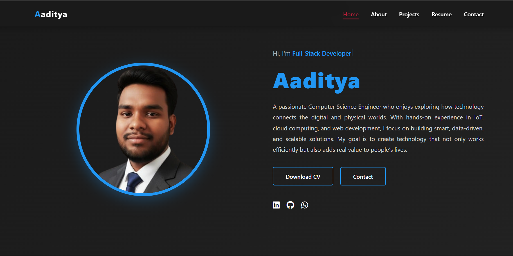

# 🌐 Aditya Channe — Personal Portfolio Website

Welcome to my **personal portfolio**, a modern and interactive space where I showcase my skills, projects, experience, and digital journey as a **Software Engineer & MERN Developer** from Nagpur, Maharashtra.

---

## 🚀 Live Preview  
Check out the deployed version of my portfolio:  
👉 [Live Link](https://adityachanne13.github.io/Aaditya-Portfolio/)

---

## ✨ Key Features

### 🎯 Modern Hero Section  
A clean, bold hero section with a typing animation highlighting my expertise —  
**MERN Developer • Software Engineer • Tech Enthusiast**

### 📱 Fully Responsive  
Smooth layout scaling for **desktop, tablet, and mobile** devices.

### 👨‍💻 About Me  
A dedicated section showing my bio, skill tags, and a professional profile image.

### 🧩 Projects Showcase  
Grid-based interactive project cards with hover effects and smooth transitions.

### 📄 Resume Timeline  
A visually appealing vertical timeline showcasing:  
- Experience  
- Education  
- Certifications  

### 📬 Contact Section  
A working contact form with social media links and minimalist UI.

### 🧭 Smart Navigation  
Smooth scrolling, animated section reveal, and auto-active nav highlighting.

---

## 🛠 Technologies Used

This portfolio is built with:

- **HTML5**  
- **CSS3 (Flexbox, Grid, Animations)**  
- **JavaScript (ES6+)**  
- **Font Awesome Icons**

---

## 📂 Project Structure

```
📦 Aaditya-Portfolio
│
├── 📄 index.html        — Main HTML file
├── 🎨 styles.css        — CSS stylesheet
├── ⚙️ script.js         — JavaScript interactions
├── 🖼️ images/           — Profile + project images
└── 📘 README.md         — Project documentation
```

---

## ⚙️ Setup Instructions

1. Clone the repository:
   ```bash
   git clone https://github.com/Adityachanne13/Aaditya-Portfolio.git
   ```
2. Navigate to the project folder:
   ```bash
   cd Aaditya-Portfolio
   ```
3. Open `index.html` in your favorite browser to view the website.

---

## 📜 License

This project is licensed under the terms described in the [LICENSE] file.

---

## 📬 Contact

- Email: adityachanne786@gmail.com   
- Location: Nagpur, Maharashtra  
- LinkedIn: [LinkedIn](https://www.linkedin.com/in/aditya-c-8376862aa)  
- GitHub: https://github.com/Adityachanne13
  
---

Made with ❤️ and clean code by **Aaditya Channe**
